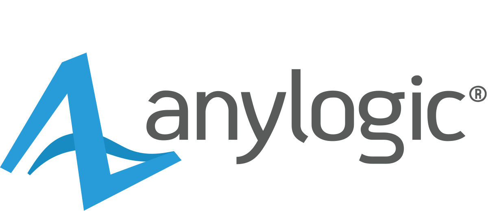

# Tutorial AnyLogic: simulação baseada em agentes

O **AnyLogic** é um ambiente de simulação que reúne, num único software, os três grandes métodos da simulação: **eventos discretos**, **dinâmica de sistemas** e **modelagem baseada em agentes**.&#x20;

<figure><figcaption></figcaption></figure>

Este volume III foca o conteúdo de **Modelagem Baseada em Agentes** do AnyLogic. O volume I foca a **Simulação de Eventos Discretos ou** **Modelagem baseada em Processos**, disponível neste [link](https://tutorial.anylogicbrasil.com.br/), e o volume II foca a **Simulação de Dinâmica de Sistemas** do AnyLogic e está disponível [neste link](https://tutorial-ds.anylogicbrasil.com.br/).

Se você chegou até aqui vindo dos dois primeiros volumes desta série, já conhece bem dois dos três. Falta o mais divertido.

Na **modelagem baseada em agentes** (ou ABM, de _agent-based modeling_) a gente não descreve o sistema de cima para baixo, como um fluxo de processos ou um conjunto de equações. A gente descreve o comportamento de **um** indivíduo — um cliente, um veículo, um vírus, uma pessoa — e deixa o comportamento coletivo _emergir_ da interação de muitos desses indivíduos.&#x20;

O motor central desse comportamento individual é o **statechart** (diagrama de estados), e é nele que vamos passar a maior parte do nosso tempo.

Para não ficar no abstrato, vamos resolver um problema concreto e atualíssimo: **quantos carregadores um hub de recarga de veículos elétricos precisa ter** para atender bem seus motoristas sem desperdiçar dinheiro? É o mesmo tipo de pergunta de dimensionamento de recurso que resolvemos no volume de processos (quantos caixas no banco?), mas agora cada motorista é um agente que dirige pela cidade, fica sem bateria, vai até o hub, enfrenta (ou não) uma fila e volta a rodar.

Ao final deste tutorial você terá:

* construído, do zero, um modelo baseado em agentes com **statechart**, **população de agentes** e **movimento em espaço 2D**;
* coletado indicadores de **nível de serviço**, **fila** e **utilização**;
* enviado o modelo para a **AnyLogic Cloud** e rodado um experimento de **variação de parâmetros** para dimensionar o hub;
* analisado os resultados e tomado uma decisão de engenharia com base neles.

Vamos nessa.

***

